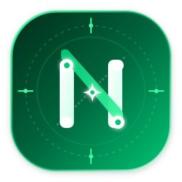

<p align="center">
  <picture>
    <source media="(prefers-color-scheme: dark)" srcset="public/navelix-logo-dark.svg">
    
  </picture>
</p>

<p align="center">
  <strong>Your all-in-one personal digital workspace</strong><br>
  Bookmark hub · AI assistant · Multi-scale Gantt · Calendar & todos · Cross-device sync · Local-first SQLite
</p>

<p align="center">
  🌐 <strong>English</strong> · <a href="README.md">简体中文</a>
</p>

<p align="center">
  <a href="https://github.com/timorpic/Navelix/releases"></a>
  <a href="https://hub.docker.com/r/timorpic/navelix"></a>
  <a href="LICENSE"></a>
  <a href="https://github.com/timorpic/Navelix/wiki"></a>
  <a href="https://t.me/+c6qtFiK5Lk9hZDZl"></a>
</p>

---

## Your personal digital hub, all on one home page

**Navelix (Personal Digital Hub)** is a modern, full-featured personal digital workspace built for geeks, developers, and independent creators:
bookmark navigation, AI assistant, project kanban, interactive Gantt charts, calendar & todos — all on a single home page.

Zero external database dependencies, single lightweight container, and 100% of your data stays on your own machine.

### Why Navelix?

- 🧭 **One-stop workspace**: bookmarks, AI assistant, project board, Gantt, calendar & productivity tools in a single home page
- 🤖 **Deep AI integration**: standard OpenAI-compatible API, one-click project breakdown into action lists, daily schedule planning, real-time model quota monitoring
- 📱 **Multi-device sync**: cross-device roaming, Chrome extension quick capture, PWA / iOS Shortcuts widgets
- 🔒 **Privacy-first & local storage**: zero external dependencies, data on your own machine, SQLite hot backups, S3 / WebDAV cloud disaster recovery, public/private access & brute-force rate limiting

## Screenshots

<table width="100%">
  <tr>
    <td align="center"></td>
    <td align="center"></td>
  </tr>
  <tr>
    <td align="center"></td>
    <td align="center"></td>
  </tr>
</table>

## Core Features

| Module | Highlights |
| :--- | :--- |
| 🔖 **Bookmark hub** | Link/category management, quick access, in-app universal search, `⌘K` quick focus, multi-format bookmark import/export, Markdown notes with AI summaries, link liveness & latency probe (Pro) |
| 📊 **Projects & Gantt** | 4-dimension dashboard (progress/tasks/risk/updates), multi-scale interactive Gantt (21-day agile / 12-month yearly / 3-year roadmap) |
| 📅 **Calendar & productivity** | Month/week/today views, strict local-timezone handling, overdue rollover (to today or spread across the week), ICS calendar export (subscribe-ready), focus-time tracking |
| 🤖 **AI hub** | Standard OpenAI-compatible API, project breakdown into action lists, daily schedule planning, Antigravity / Codex quota monitoring |
| 📱 **Multi-device ecosystem** | Chrome extension capture, PWA / iOS Shortcuts, offline Service Worker, cross-device roaming |
| 🔌 **Open API** | Personal Access Token (`nvx_live_...`) Bearer auth, full [REST API docs](wiki/REST-API-开放接口文档.md) |
| 🔒 **Security** | Public/private access, SSRF loopback isolation, CSRF header defense, brute-force rate limiting, AES-256-GCM secret encryption |

## Documentation

Full user guide, architecture, security specs and API docs live in the [Wiki](https://github.com/timorpic/Navelix/wiki):

| Doc | What's inside |
| :--- | :--- |
| [📖 User Guide](wiki/User-Guide-功能使用指南.md) | Bookmarks, Gantt, calendar, AI breakdown, appearance customization |
| [🚀 Quick Start](wiki/Quick-Start-快速入门.md) | Docker / Compose one-click deploy, Node.js source deploy & first-run setup |
| [🏗️ Architecture](wiki/Architecture-系统架构与技术选型.md) | Next.js 16, React 19, SQLite WAL design & migration system |
| [🛡️ Security & Ops](wiki/Security-安全机制与运维规范.md) | Permissions, CSRF, SSRF, rate limiting, hot-snapshot & backup rules |
| [🔌 REST API Reference](wiki/REST-API-开放接口文档.md) | Full OpenAPI spec, token auth, calendar subscription & automation |
| [❓ FAQ & Troubleshooting](wiki/FAQ-常见问题与故障排查.md) | Deployment, timezone/calendar, backup-restore and common issues |
| [📋 Changelog](CHANGELOG.md) | Version history and release notes (synced to GitHub Releases) |

---

## Quick Start

```bash
pnpm install
pnpm dev          # Local dev, http://localhost:3721
```

On first launch an admin `admin` is created automatically; a random password is printed to the console and saved to `data/navelix-admin-password.txt`.

### Docker deploy (recommended)

```yaml
services:
  navelix:
    image: timorpic/navelix:latest
    container_name: navelix
    restart: unless-stopped
    ports:
      - "3721:3721"
    environment:
      - PORT=3721
      - HOSTNAME=0.0.0.0
      - NAVELIX_ADMIN_PASSWORD=your_secure_password  # optional: set the initial admin password
      - NAVELIX_COOKIE_SECURE=false                  # keep false for LAN http; set true behind HTTPS
      - TZ=Asia/Shanghai
    volumes:
      - ./data:/app/data
```

> 💡 Note: the `docker-compose.yml` shipped in this repo uses a different container name and volume path than this example — for ops commands, always use the `container_name` you actually deployed.

Run it:

```bash
docker compose up -d
# Open http://<host-ip>:3721 in your browser
```

---

## Environment Variables

| Variable | Default | Description |
| --- | --- | --- |
| `PORT` | `3721` | Port the service listens on inside the container |
| `HOSTNAME` | `0.0.0.0` | Network bind address |
| `NAVELIX_ADMIN_PASSWORD` | *(empty)* | Initial admin password; if empty a strong one is auto-generated |
| `NAVELIX_COOKIE_SECURE` | `false` | Cookie Secure attribute; keep `false` on HTTP, set `true` behind HTTPS |
| `TRUST_PROXY` | `false` | Whether to trust the `X-Forwarded-For` header from a reverse proxy |
| `NAVELIX_DATA_DIR` | `/app/data` | Data directory (SQLite DB, backups, logs and initial password file); `/app/data` inside the Docker image, `<cwd>/data` for source deploys |
| `NAVELIX_LICENSE_KEY` | *(empty)* | Commercial license key; inject it at container start to activate, or activate later from the admin console |
| `NAVELIX_GITHUB_REPO` | `timorpic/Navelix` | GitHub repo (`owner/repo`) used for version update checks; point it at your own repo after forking |
| `NAVELIX_ANALYTICS` | `on` | Local usage-analytics switch; data is written only to the local SQLite database and never leaves your machine (can also be disabled in the admin console) |
| `NAVELIX_ANALYTICS_REPORT` | `on` | Anonymous weekly telemetry switch; `off` disables it (also toggleable under "Personal Account & Security" in the admin console) |
| `NAVELIX_ANALYTICS_ENDPOINT` | *(built-in endpoint)* | Self-hosted anonymous telemetry receiver; pairs with `NAVELIX_ANALYTICS_TOKEN` and `NAVELIX_ANALYTICS_TIMEOUT_MS`, normally not needed |
| `TZ` | `UTC` | Container timezone; the image sets no default (UTC) and the example Compose sets `Asia/Shanghai` — pass `TZ` explicitly for your local timezone |

---

## Data & Privacy

All data is stored in local SQLite (`data/navelix.db`). AI / weather API keys live only in the local database and are proxied server-side; they are never leaked when exporting config. Built-in physical hot backup and fast restore are included.

**Anonymous telemetry**: Navelix enables an anonymous weekly report by default (aggregate feature-usage counts only, with no personal information) to help the author improve the product. On first launch the console prints an explicit notice. To turn it off: use the "Anonymous Telemetry" card under "Personal Account & Security" in the admin console, or set the environment variable `NAVELIX_ANALYTICS_REPORT=off`.

---

## License

This project is released under the **Navelix Source-Available License** (source-available with commercial terms, see [LICENSE](LICENSE)):

- **Personal & non-commercial use**: free to download, install and self-host;
- **Open-source contribution**: PRs, issues and ecosystem widget adaptations are welcome;
- **Commercial & enterprise use**: a commercial license is required to deploy in a commercial production environment;
- **Prohibited**: without written permission, reselling as SaaS, charging for redistribution, or repackaging into competing products.

---

**Navelix · Personal Digital Hub** — every everyday entry point, right where it belongs.