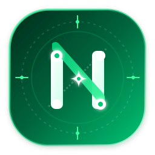

<p align="center">
  <picture>
    <source media="(prefers-color-scheme: dark)" srcset="public/navelix-logo-dark.svg">
    
  </picture>
</p>

<p align="center">
  <strong>现代化全栈个人数字工作空间</strong><br>
  网址导航 · AI 智能助手 · 21天甘特图 · 日历日程 · 跨设备漫游 · 本地优先 SQLite
</p>

<p align="center">
  <a href="https://github.com/timorpic/Navelix/releases"></a>
  <a href="https://github.com/timorpic/Navelix/pkgs/container/navelix"></a>
  <a href="LICENSE"></a>
  <a href="https://github.com/timorpic/Navelix/wiki"></a>
</p>

---

你的个人数字工作空间——网址导航、AI 智能助手、项目管理看板、交互式甘特图、日历日程与效率工具，收进同一个首页。零外部数据库依赖，单容器轻量高效运行。

## 界面预览

<table width="100%">
  <tr>
    <td align="center"></td>
    <td align="center"></td>
  </tr>
  <tr>
    <td align="center"></td>
    <td align="center"></td>
  </tr>
</table>

## 功能特性

- 🧭 **网址导航**：链接/分类管理、快捷访问、多引擎搜索、`⌘K` 快速聚焦、Favicon 自动提取、书签多格式导入导出、全站链接健康自动巡检
- 🤖 **AI 智能助手**：接入标准 OpenAI 兼容 API（DeepSeek / ChatGPT / Ollama / Qwen 等），服务端代理不泄露 Key；项目一键拆解为行动清单、每日日程智能规划、反重力/大模型账号额度实时监控
- 👥 **团队协作与多端同步**：支持多成员协同、项目公开分享、SSE 实时状态同步、后台定时顺延守护进程（Daemon）
- 📊 **项目与甘特图**：四维指标看板（进度/任务/风险/更新）、21 天交互式甘特图（周末高亮 / 今日指示线 / 里程碑进度与动作清单）
- 📅 **日历与效率**：月/周/今日视图、本地时区严格计算与跳日防御、过期待办一键/自动顺延（Rollover）、标准 ICS 日历双向订阅（Apple / Google / Outlook）、番茄钟、天气与指针表盘
- 📱 **多端生态扩展**：
  - **Chrome 浏览器扩展**（`/extension`）：品牌化独立 Popup、深浅色主题自适应、一键/右键快速收藏采集、幂等入库
  - **移动端 PWA & 快捷指令**：离线 Service Worker 缓存壳、`?action` 快速采集入口、iOS 快捷指令与 Scriptable 小组件支持
- 🔒 **企业级安全体系**：公开/私有两种访问模式、开放/关闭注册、SSRF 回环隔离、CSRF 头防御、防爆破限流、HttpOnly 安全会话、OAuth Secret / Token 敏感字段 AES 加密落库
- 💾 **备份还原**：SQLite `VACUUM INTO` 物理热备份、`.db` 物理快照一键下载还原、S3 / WebDAV 异地云容灾备份、全量 JSON 导入导出
- ⚙️ **系统扩展**：自定义搜索引擎（`%s` 模板）、书签实时网络延迟与存活探针、全站品牌与 LOGO 自定义、自定义代码与统计探针注入
- 🔌 **开放 API**：Personal Access Token（`nvx_live_...`）Bearer 鉴权，完整 [API 文档](wiki/REST-API-开放接口文档.md) 集成脚本与自动化
- 🛠️ **管理后台**（`/admin`）：链接/项目/用户/Token/会话管理、外观定制、版本自检与在线升级提醒

---

## 快速开始

```bash
pnpm install
pnpm dev          # 本地开发，http://localhost:3721
```

首次启动自动创建管理员 `admin`，随机密码输出到控制台及 `data/navelix-admin-password.txt`。

### Docker 部署（推荐）

```yaml
version: '3.8'
services:
  navelix:
    image: timorpic/navelix:latest
    container_name: navelix
    restart: unless-stopped
    ports:
      - "3721:3721"
    environment:
      - PORT=3721
      - HOSTNAME=0.0.0.0
      - NAVELIX_ADMIN_PASSWORD=your_secure_password  # 可选：指定初始管理员密码
      - NAVELIX_COOKIE_SECURE=false                  # 局域网 http 保持 false；HTTPS 时改为 true
      - TZ=Asia/Shanghai
    volumes:
      - ./data:/app/data
```

运行命令：

```bash
docker compose up -d
# 浏览器访问 http://<主机IP>:3721
```

---

## 环境变量说明

| 环境变量 | 默认值 | 说明 |
| --- | --- | --- |
| `PORT` | `3721` | 容器内服务监听端口 |
| `HOSTNAME` | `0.0.0.0` | 绑定网络主机地址 |
| `NAVELIX_ADMIN_PASSWORD` | *(留空)* | 初始管理员密码，留空则自动生成强密码 |
| `NAVELIX_COOKIE_SECURE` | `false` | Cookie Secure 属性；HTTP 保持 `false`，HTTPS 设为 `true` |
| `TRUST_PROXY` | `false` | 是否信任反向代理 `X-Forwarded-For` 标头 |
| `NAVELIX_IMAGE_REPO` | `timorpic/navelix` | 版本更新检测使用的镜像仓库 |
| `TZ` | `Asia/Shanghai` | 容器运行时时区配置 |

---

## 数据与隐私

所有数据存储在本地 SQLite（`data/navelix.db`）。AI API Key / 天气 Key 仅保存在本地数据库且由服务端安全代理，导出配置时不会泄露。系统具备内置物理热备份与快速数据恢复。

---

## 许可证

本项目采用 **Navelix Source-Available 许可证**（源码可用与商业授权协议，详见 [LICENSE](LICENSE)）：

- **个人与非商业用途**：个人可免费下载、安装与本地私有部署使用；
- **开源贡献**：欢迎提交 Pull Request、Issue 与生态小组件适配；
- **商业与企业用途**：企业或团队在商业生产环境中部署使用须持有官方商业许可证；
- **禁止事项**：未经官方书面许可，严禁将本软件用于商业 SaaS 托管变现、付费转售或二次打包发布衍生竞品。

---

**Navelix · Personal Digital Hub** — 让每一个常用入口，都在它该在的地方。
