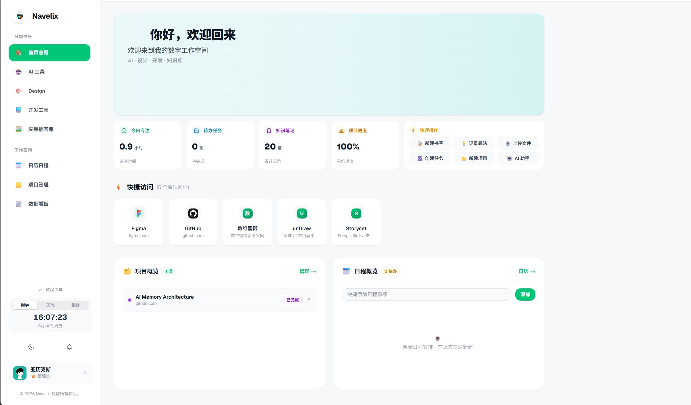
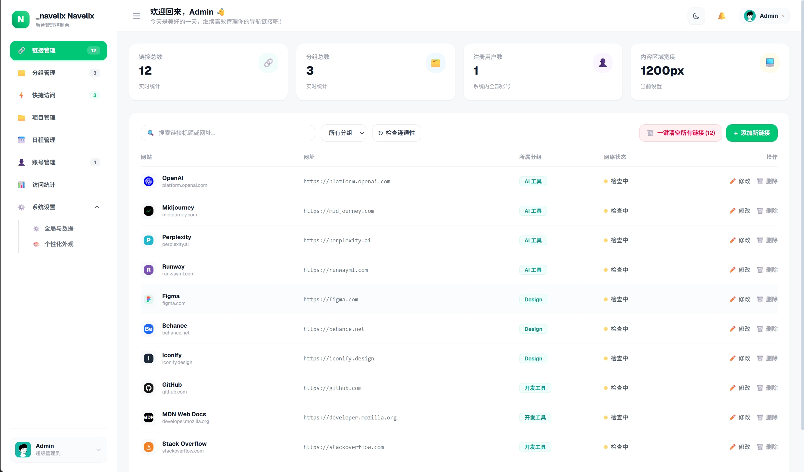
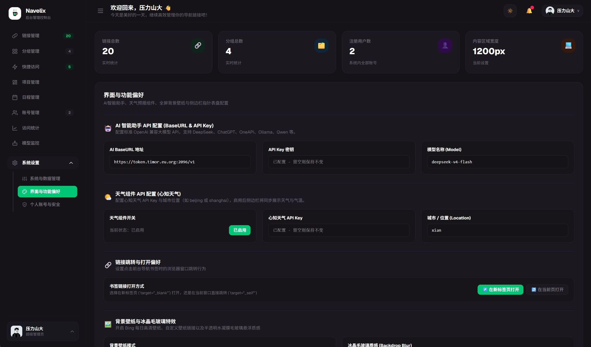
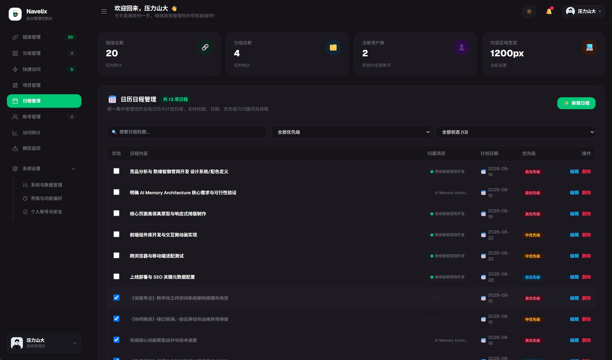

# Navelix · Personal Digital Hub

你的个人与团队数字工作空间——网址导航、AI 智能助手、项目管理看板、交互式甘特图、多用户协同、日历日程与效率工具，收进同一个首页。零外部数据库依赖，单容器轻量高效运行。

## 界面预览

<table width="100%">
  <tr>
    <td align="center"></td>
    <td align="center"></td>
  </tr>
  <tr>
    <td align="center"></td>
    <td align="center"></td>
  </tr>
</table>

## 功能特性

- **网址导航与资产中心**：
  - 链接管理、分类层级筛选、快捷访问、多搜索引擎支持与全局 `⌘ K` / `Ctrl+K` 快速聚焦搜索。
  - 图标自定义（本地上传 / Iconify / 自动提取 Favicon）、在线状态定期巡检、书签多格式导入导出（Sun-Panel / Chrome / HTML）。
  - 内置 unDraw、Storyset、DrawKit 等常用矢量插画库与 Iconfont、IconPark、Tabler、Iconoir 等图标库及商用授权指引。

- **AI 智能助手与项目拆解引擎**：
  - 集成标准 OpenAI 兼容 API（DeepSeek、ChatGPT、Ollama、Qwen、Claude 等），服务端安全代理请求，Key 不暴露前端。
  - **✨ AI 项目智能拆解**：输入项目构想，一键由大模型自动拆解为敏捷阶段行动清单，智能推荐责任人与合理交付周期；内置规则回退引擎，无 Key 也能 100% 离线可用。
  - **✨ AI 日程智能规划**：结合当前未完成待办与活跃项目，智能生成每日聚焦排程建议。

- **多用户协同与权限体系**：
  - 支持多用户注册与管理，任务与里程碑支持分配至具体团队成员（`👤 责任人`）。
  - 多用户实时活跃状态感知，团队成员操作实时同步更新。

- **项目管理与交互式甘特图**：
  - **项目四维指标看板**：实时呈现 **进度 🟢**、**任务 🟢**、**风险研判 🟡**（智能逾期/攻坚预警）、**最近更新 ⏱️**（多用户动态相对时间）。
  - **交互式甘特图**：21 天平滑时间轴视窗，周末智能高亮、今日脉冲指示线、里程碑进度条、优先级色彩标签、责任人徽章与一键状态切换。
  - 支持已拆解里程碑内容的二次交互编辑与原子级增删改同步。

- **日历日程与效率工具**：
  - 月视图 / 周视图 / 今日聚焦多维切换，全站采用严格本地时区计算，杜绝跨时区偏差。
  - **过期待办一键顺延**：支持一键顺延至今日或均匀平摊到本周剩余天数。
  - 专注番茄钟、实时天气与指针表盘、首页项目/日程/知识库联动概览。

- **安全与访问控制**：
  - 支持**公开访客模式**（免登录浏览首页）与**私有模式**（未登录强制跳转登录）。
  - 支持**开放/关闭公网注册**，杜绝公网部署被任意注册。
  - 内置 SSRF 防护（SafeFetch 校验）、全局 CSRF 校验、登录 Rate Limit 防暴破、HttpOnly Cookie 会话控制。

- **高可用与物理备份还原**：
  - SQLite 级联删除 (CASCADE)、外键约束校验、`VACUUM INTO` 零锁定热备份。
  - **一键下载 `.db` 物理快照**，支持上传 `.db` 备份文件一键还原全量数据与所有系统配置。
  - **一键全量 JSON 导出与恢复**，包含全部系统偏好、外观设置与离线数据。

- **系统运维与代码注入**：
  - **自定义搜索引擎**：支持配置私有搜索引擎（如 SearXNG、内网知识库）与 `%s` URL 模板。
  - **自定义代码与统计探针**：无需修改源码，后台直接注入 Umami / Google Analytics / 百度统计等 `<script>` 探针与全局自定义 CSS。
  - **存储整理与清理**：一键清理历史操作通知，执行 SQLite `VACUUM` 深度碎片整理。

- **开放 API & 自动化 (Personal Access Token)**：
  - 支持 Personal Access Token (`nvx_live_...`) Bearer 鉴权。
  - 提供完整 [API Wiki 开发文档](API_WIKI.md)，轻松集成 iOS 快捷指令、Docker CI/CD 消息推送、Python 自动化脚本与 AI 智能体。

- **管理后台**（`/admin`）：
  - 链接/分组/项目/用户管理、个人 API Token 管理、活跃会话踢出、个性化外观定制、访问统计、实时版本更新自检。

---

## 技术栈

Next.js 16 (Turbopack) + React 19 + TypeScript + Tailwind CSS 4 + SQLite (`node:sqlite`) + pnpm

---

## 快速开始

```bash
pnpm install
pnpm dev          # 本地开发，http://localhost:3721
```

首次启动自动创建管理员 `admin`，随机密码输出到控制台及 `data/navelix-admin-password.txt`。

### Docker 部署（推荐）

```yaml
version: '3.8'
services:
  navelix:
    image: timorpic/navelix:latest
    container_name: navelix
    restart: unless-stopped
    ports:
      - "3721:3721"
    environment:
      - PORT=3721
      - HOSTNAME=0.0.0.0
      - NAVELIX_ADMIN_PASSWORD=your_secure_password  # 可选：指定初始管理员密码
      - NAVELIX_COOKIE_SECURE=false                  # 局域网 http 保持 false；HTTPS 时改为 true
      - TZ=Asia/Shanghai
    volumes:
      - ./data:/app/data
```

运行命令：

```bash
docker compose up -d
# 浏览器访问 http://<主机IP>:3721
```

---

## 环境变量说明

| 环境变量 | 默认值 | 说明 |
| --- | --- | --- |
| `PORT` | `3721` | 容器内服务监听端口 |
| `HOSTNAME` | `0.0.0.0` | 绑定网络主机地址 |
| `NAVELIX_ADMIN_PASSWORD` | *(留空)* | 初始管理员密码，留空则自动生成强密码 |
| `NAVELIX_COOKIE_SECURE` | `false` | Cookie Secure 属性；HTTP 保持 `false`，HTTPS 设为 `true` |
| `TRUST_PROXY` | `false` | 是否信任反向代理 `X-Forwarded-For` 标头 |
| `NAVELIX_IMAGE_REPO` | `timorpic/navelix` | 版本更新检测使用的镜像仓库 |
| `TZ` | `Asia/Shanghai` | 容器运行时时区配置 |

---

## 数据与隐私

所有数据存储在本地 SQLite（`data/nexus.db`）。AI API Key / 天气 Key 仅保存在本地数据库且由服务端安全代理，导出配置时不会泄露。系统具备内置物理热备份与快速数据恢复。

---

## 许可证

本项目采用**自定义许可证**（详见 [LICENSE](LICENSE)）：

- 个人非商业用途可免费使用
- **禁止修改**（不得创建衍生作品）
- **禁止商用**，商业使用必须联系作者获得书面授权

---

**Navelix · Personal Digital Hub** — 让每一个常用入口，都在它该在的地方。
