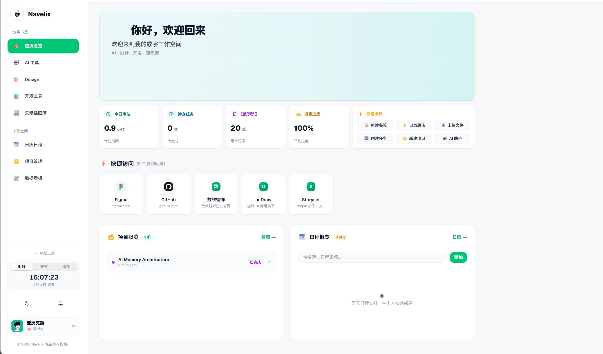
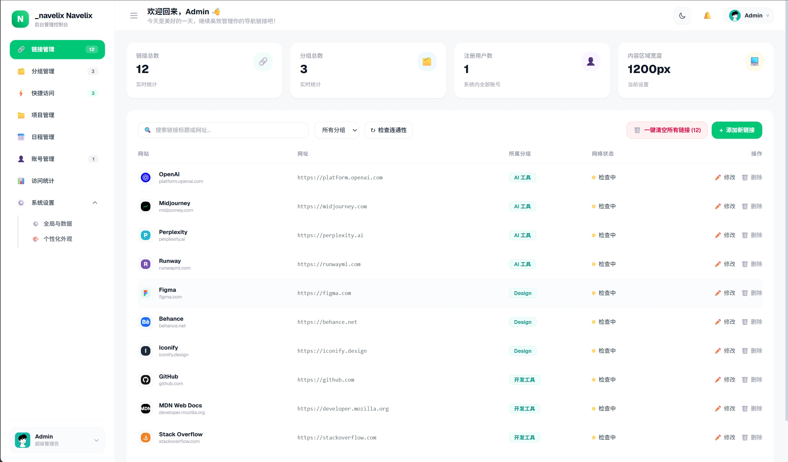
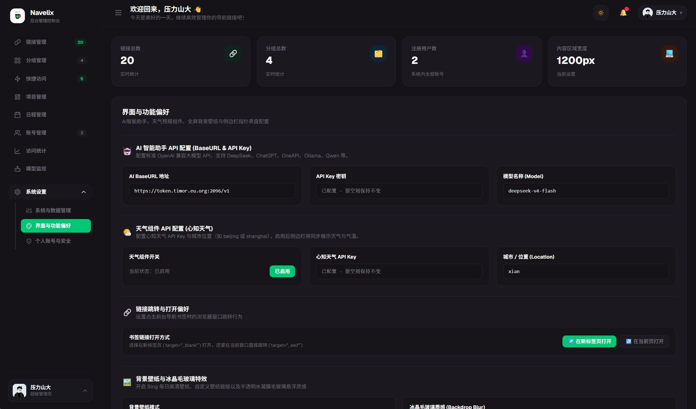
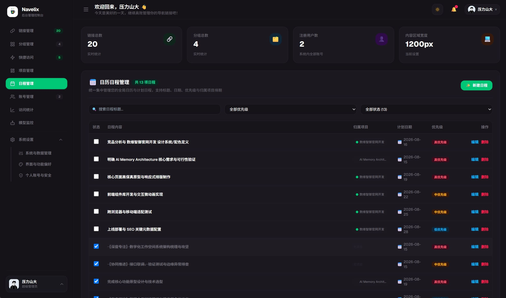

<p align="center">
  <picture>
    <source media="(prefers-reduced-motion: reduce) and (prefers-color-scheme: dark)" srcset="public/navelix-logo-dark.svg">
    <source media="(prefers-reduced-motion: reduce)" srcset="public/navelix-logo.svg">
    <source media="(prefers-color-scheme: dark)" srcset="public/navelix-logo-dark.gif">
    
  </picture>
</p>

<p align="center">
  <strong>现代化全栈个人数字工作空间</strong><br>
  网址导航 · AI 智能助手 · 多尺度甘特图 · 日历日程 · 跨设备漫游 · 本地优先 SQLite
</p>

<p align="center">
  🌐 <a href="README.en.md">English</a> · <strong>简体中文</strong>
</p>

<p align="center">
  <a href="https://github.com/timorpic/Navelix/releases"></a>
  <a href="https://hub.docker.com/r/timorpic/navelix"></a>
  <a href="LICENSE"></a>
  <a href="https://github.com/timorpic/Navelix/wiki"></a>
  <a href="https://t.me/+c6qtFiK5Lk9hZDZl"></a>
</p>

---

## 你的私人数字中枢，收进同一个首页

**Navelix (Personal Digital Hub)** 是专为极客、开发者、独立创作者打造的现代化全功能个人数字工作空间：
网址导航、AI 智能助手、项目管理看板、交互式甘特图、日历日程与效率工具，全部收进同一个首页。

零外部数据库依赖，单容器轻量运行，数据 100% 留在你自己的机器上。

### 为什么选择 Navelix？

- 🧭 **一站式工作空间**：网址导航、AI 助手、项目看板、甘特图、日历与效率工具，收进同一个首页
- 🤖 **AI 深度整合**：标准 OpenAI 兼容 API、项目一键拆解为行动清单、每日日程智能规划、账号额度实时监控
- 📱 **多端协同**：跨设备数据漫游、Chrome 扩展快速采集、PWA / iOS 快捷指令小组件
- 🔒 **隐私优先 & 本地存储**：单容器零外部依赖、数据留在自己的机器、SQLite 物理热备份、S3 / WebDAV 云容灾、公开/私有访问与防爆破限流

## 界面预览

<table width="100%">
  <tr>
    <td align="center"></td>
    <td align="center"></td>
  </tr>
  <tr>
    <td align="center"></td>
    <td align="center"></td>
  </tr>
</table>

## 核心能力

| 模块 | 亮点 |
| :--- | :--- |
| 🔖 **网址导航** | 链接/分类管理、快捷访问、系统内全类型搜索、`⌘K` 快速聚焦、书签多格式导入导出、Markdown 笔记与 AI 摘要、链接存活与延迟探针（Pro） |
| 📊 **项目与甘特图** | 四维指标看板（进度/任务/风险/更新）、多尺度交互式甘特图（21 天敏捷 / 12 月年度 / 3 年跨年路线图） |
| 📅 **日历与效率** | 月/周/今日视图、本地时区严格计算、过期待办一键/按周平摊（Rollover）、ICS 日历导出（可订阅）、专注时长统计 |
| 🤖 **AI 智能中枢** | 标准 OpenAI 兼容 API、项目拆解为行动清单、每日日程规划、反重力 / Codex 账号额度实时监控 |
| 📱 **多端生态** | [⬇️ 下载扩展 zip](https://github.com/timorpic/Navelix/releases/download/extension-v1.1.0/navelix-extension-v1.1.0.zip) · Chrome 扩展快速采集、PWA / iOS 快捷指令、离线 Service Worker、跨设备漫游 |
| 🔌 **开放 API** | Personal Access Token（`nvx_live_...`）Bearer 鉴权，完整 [REST API 文档](wiki/REST-API-开放接口文档.md) |
| 🔒 **安全体系** | 公开/私有访问、SSRF 回环隔离、CSRF 头防御、防爆破限流、敏感字段 AES 加密落库 |

## 浏览器扩展（Chrome / Edge）

一键收藏网页到你的 Navelix 库：

- **下载**：[⬇️ navelix-extension-v1.1.0.zip](https://github.com/timorpic/Navelix/releases/download/extension-v1.1.0/navelix-extension-v1.1.0.zip)（约 25 KB）
- **安装**：解压后，在 `chrome://extensions`（或 `edge://extensions`）开启「开发者模式」→「加载已解压的扩展程序」→ 选择解压后的文件夹
- **配置**：点击工具栏扩展图标 →「设置」→ 填写实例地址与 API 令牌（后台 → API 令牌 → 新建）

## 文档中心

### 项目开发文档

| 文档 | 内容 |
| :--- | :--- |
| [协作规范](AGENTS.md) · [Claude Code 上下文](CLAUDE.md) | 通用开发约定与工具入口 |
| [技术栈与架构](docs/ARCHITECTURE.md) | Next.js 16、React 19、Tailwind CSS 4、TypeScript 与 Node SQLite；目录和数据流 |
| [产品规格](docs/PROJECT-SPEC.md) | 项目定位、目标用户与功能边界 |
| [视觉设计](DESIGN.md) · [组件规范](docs/COMPONENT-GUIDELINES.md) | 主题、布局、交互、依赖与无障碍 |
| [页面结构](docs/PAGE-STRUCTURE.md) | 页面路由、首页视图与后台功能区 |
| [开发与发布](docs/DEVELOPMENT.md) | 本地开发、测试、数据库变更与版本维护 |
| [构建与分发](docs/REGISTRY.md) | 应用产物、镜像校验与 EE 驱动注册；当前无独立组件 registry |
| [构建与部署](docs/DEPLOYMENT.md) | Docker、源码部署、持久化、升级与回滚 |
| [开发计划](TODO.md) · [更新日志](CHANGELOG.md) | 当前进度、待办与版本历史 |

### 用户与运维手册

完整的功能手册、架构说明、安全规范与 API 文档都在 [Wiki](https://github.com/timorpic/Navelix/wiki)：

| 文档 | 内容 |
| :--- | :--- |
| [📖 功能使用全手册](wiki/User-Guide-功能使用指南.md) | 书签管理、甘特图、日历日程、AI 拆解、外观定制实战 |
| [🚀 快速入门指南](wiki/Quick-Start-快速入门.md) | Docker / Compose 一键部署、Node.js 源码部署与首次初始化 |
| [🏗️ 系统架构与技术选型](wiki/Architecture-系统架构与技术选型.md) | Next.js 16、React 19、SQLite WAL 架构设计与迁移体系 |
| [🛡️ 安全机制与运维规范](wiki/Security-安全机制与运维规范.md) | 权限、CSRF、SSRF、限流防爆破、物理快照与热备规范 |
| [🔌 REST API 开放接口规范](wiki/REST-API-开放接口文档.md) | 全量 OpenAPI 规范、Token 鉴权、日历订阅与自动化案例 |
| [❓ 常见问题与故障排查](wiki/FAQ-常见问题与故障排查.md) | 部署运维、时区日历、备份恢复等高频疑难解答 |
| [📋 更新日志](CHANGELOG.md) | 各版本变更历史与发布说明（发版时同步至 GitHub Releases） |

---

## 快速开始

需要 Node.js 24（至少 24.0.0，建议使用最新补丁版）和 `package.json` 声明的 pnpm 版本。完整环境与验证流程见 [开发说明](docs/DEVELOPMENT.md)。

```bash
corepack enable
pnpm install --frozen-lockfile
pnpm dev          # 本地开发，http://localhost:3721
```

首次启动自动创建管理员 `admin`，随机密码输出到控制台及 `data/navelix-admin-password.txt`。

### Docker 部署（推荐）

```yaml
services:
  navelix:
    image: timorpic/navelix:latest
    container_name: navelix
    restart: unless-stopped
    ports:
      - "3721:3721"
    environment:
      - PORT=3721
      - HOSTNAME=0.0.0.0
      - NAVELIX_ADMIN_PASSWORD=your_secure_password  # 可选：指定初始管理员密码
      - NAVELIX_COOKIE_SECURE=false                  # 局域网 http 保持 false；HTTPS 时改为 true
      - TZ=Asia/Shanghai
    volumes:
      - ./data:/app/data
```

> 💡 提示：仓库自带 `docker-compose.yml` 使用 `/volume1/docker/navelix` 挂载数据，并包含可选 Watchtower 服务；请按实际主机调整路径和自动更新策略。

运行命令：

```bash
docker compose up -d
# 浏览器访问 http://<主机IP>:3721
```

---

## 环境变量说明

| 环境变量 | 默认值 | 说明 |
| --- | --- | --- |
| `PORT` | `3721` | 容器内服务监听端口 |
| `HOSTNAME` | `0.0.0.0` | 绑定网络主机地址 |
| `NAVELIX_ADMIN_PASSWORD` | *(留空)* | 初始管理员密码，留空则自动生成强密码 |
| `NAVELIX_COOKIE_SECURE` | `false` | Cookie Secure 属性；HTTP 保持 `false`，HTTPS 设为 `true` |
| `TRUST_PROXY` | `false` | 是否信任反向代理 `X-Forwarded-For` 标头 |
| `NAVELIX_DATA_DIR` | `/app/data` | 数据存储目录（SQLite 库、备份、日志与初始密码文件）；Docker 镜像内为 `/app/data`，源码部署默认为 `<cwd>/data` |
| `NAVELIX_LICENSE_KEY` | *(留空)* | 商业版 License Key；容器启动时注入激活，也可在管理后台网页激活 |
| `NAVELIX_GITHUB_REPO` | `timorpic/Navelix` | 版本更新检测使用的 GitHub 仓库（`owner/repo`）；fork 后可指向自己的仓库 |
| `NAVELIX_ANALYTICS` | `on` | 本地使用统计开关；数据仅写入本机 SQLite、永不外发（也可在管理后台「访问统计」页关闭） |
| `NAVELIX_ANALYTICS_REPORT` | `on` | 匿名遥测周报总开关；`off` 关闭（也可在管理后台「个人账号与安全」页一键开关） |
| `NAVELIX_ANALYTICS_ENDPOINT` | *(内置端点)* | 自建匿名遥测接收端；配套 `NAVELIX_ANALYTICS_TOKEN`、`NAVELIX_ANALYTICS_TIMEOUT_MS`，一般无需设置 |
| `TZ` | `UTC` | 容器运行时时区；镜像未设默认值（UTC），示例 Compose 中设为 `Asia/Shanghai`，需要本地时区请显式传入 |

---

## 数据与隐私

所有数据存储在本地 SQLite（`data/navelix.db`）。AI API Key / 天气 Key 仅保存在本地数据库且由服务端安全代理，导出配置时不会泄露。系统具备内置物理热备份与快速数据恢复。

**匿名遥测说明**：Navelix 默认开启匿名周报（仅功能使用聚合计数，不含任何个人信息），帮助作者改进产品。首次启动时控制台会显式打印告知。关闭方式：管理后台「个人账号与安全」→「匿名遥测」卡片一键关闭，或设置环境变量 `NAVELIX_ANALYTICS_REPORT=off`。

---

## 许可证

本项目采用 **Navelix Source-Available 许可证**（源码可用与商业授权协议，详见 [LICENSE](LICENSE)）：

- **个人与非商业用途**：个人可免费下载、安装与本地私有部署使用；
- **开源贡献**：欢迎提交 Pull Request、Issue 与生态小组件适配；
- **商业与企业用途**：企业或团队在商业生产环境中部署使用须持有官方商业许可证；
- **禁止事项**：未经官方书面许可，严禁将本软件用于商业 SaaS 托管变现、付费转售或二次打包发布衍生竞品。

---

**Navelix · Personal Digital Hub** — 让每一个常用入口，都在它该在的地方。
