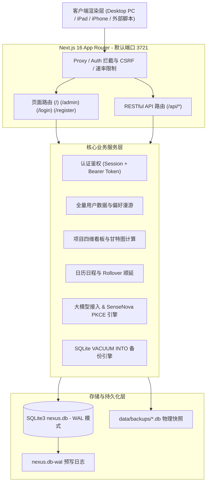

# 🏗️ 系统架构与技术选型 (Architecture & Tech Stack)

本文档深入介绍 Navelix 的底层技术选型、系统分层架构、数据存储模型与设计哲学。

---

## 🛠️ 技术选型矩阵 (Tech Stack)

| 层次 | 核心技术 | 选型理由与优势 |
| :--- | :--- | :--- |
| **全栈框架** | **Next.js 16 (Turbopack + App Router)** | 领先的 React 服务端渲染 (SSR) 框架，极速构建与静态/动态路由混合渲染 |
| **UI 视图库** | **React 19** | 最新的 React 核心，优秀的并发渲染与客户端组件状态流转 |
| **样式体系** | **Tailwind CSS 4** | 现代化原子级 CSS 框架，零运行时开销，原生暗黑模式与流畅响应式布局 |
| **持久化存储** | **SQLite3 (Node.js 原生 DatabaseSync / WAL 模式)** | 单文件中心化嵌入式数据库，极简部署无外部依赖，WAL 并发读写性能极高 |
| **安全体系** | **Node.js Crypto / Web Crypto** | 原生安全哈希 (SHA-256 / PBKDF2)、RSA-OAEP + AES-256-GCM JWE 加密 |
| **标准协议** | **RFC 5545 iCalendar / OAuth2 PKCE** | 标准日历订阅协议，通用跨平台日历互通与企业级授权协议 |

---

## 🏛️ 系统分层架构图 (Layered Architecture)

---

## 🗄️ 数据库 Schema 与表结构设计

系统所有核心数据存储于 `data/nexus.db`，核心表结构如下：

1. **`users`**：系统用户表（ID、用户名、密码哈希、显示昵称、角色 `admin/user`、头像、个人简介）；
2. **`sessions`**：用户会话表（Token 哈希、User ID、用户代理、IP 地址、过期时间）；
3. **`user_configs`**：用户偏好与系统配置表（35+ 项偏好设置、AI 密钥、商汤账号、搜索引擎、布局）；
4. **`user_categories`**：导航分类表（ID、User ID、名称、图标、色彩）；
5. **`user_links`**：导航链接表（ID、User ID、标题、URL、描述、图标、分类、快捷访问标记）；
6. **`projects`**：项目表（ID、User ID、名称、描述、状态、状态色彩、URL、排序权重、创建时间、更新时间）；
7. **`user_todos`**：待办与日程表（ID、User ID、标题、优先级、完成标记、本地截止日期、关联项目 ID、指派责任人 ID 与昵称）；
8. **`notifications`**：消息通知表（ID、User ID、标题、内容、来源声明、创建时间、已读标记）；
9. **`api_tokens`**：个人 API Access Token 表（ID、User ID、名称、SHA-256 Token 哈希、前缀、创建时间、最后使用时间）。

---

## 🔄 幂等数据库迁移体系 (Migrations Engine)

Navelix 内置了基于 `PRAGMA user_version` 的**自动无损数据库迁移引擎**：
- 每次服务启动时，系统自动检查数据库结构并按版本顺序执行迁移；
- 所有字段补齐（`ensureColumn`）与表结构升级均为**可重入与幂等操作**；
- 支持从旧版本平滑升级，无需任何手动 SQL 脚本维护。

---

*下一步：请参阅 [[安全机制与运维规范|Security-安全机制与运维规范]] 了解系统的多层安全防护。*
