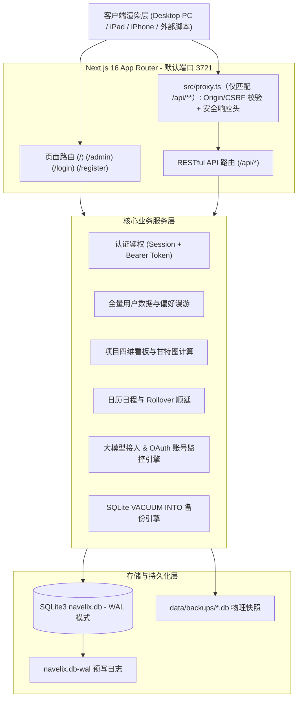

# 🏗️ 系统架构与技术选型 (Architecture & Tech Stack)

本文档深入介绍 Navelix 的底层技术选型、系统分层架构、数据存储模型与设计哲学。

---

## 🛠️ 技术选型矩阵 (Tech Stack)

| 层次 | 核心技术 | 选型理由与优势 |
| :--- | :--- | :--- |
| **全栈框架** | **Next.js 16 (Turbopack + App Router)** | 领先的 React 服务端渲染 (SSR) 框架，极速构建与静态/动态路由混合渲染 |
| **UI 视图库** | **React 19** | 最新的 React 核心，优秀的并发渲染与客户端组件状态流转 |
| **样式体系** | **Tailwind CSS 4** | 现代化原子级 CSS 框架，零运行时开销，原生暗黑模式与流畅响应式布局 |
| **持久化存储** | **SQLite3 (Node.js 原生 DatabaseSync / WAL 模式)** | 单文件中心化嵌入式数据库，极简部署无外部依赖，WAL 并发读写性能极高 |
| **运行时** | **Node.js ≥ 22.5**（镜像为 `node:22-alpine`） | 依赖内置 `node:sqlite`（`DatabaseSync`），**Node 20 无法运行**；包管理器锁定 `pnpm@11.16.0` |
| **安全体系** | **`node:crypto`** | 密码哈希使用 **scrypt**（配定时安全比较）；SHA-256 用于会话 / API Token 摘要；**AES-256-GCM** 加密敏感字段 |
| **标准协议** | **RFC 5545 iCalendar / OAuth2** | 标准日历导出（`text/calendar`）与 OAuth2 授权流程。**PKCE（S256）目前仅 Codex 使用**，反重力走传统 `client_secret` 授权码流程 |

---

## 🏛️ 系统分层架构图 (Layered Architecture)


```mermaid
graph TD
    Client["客户端渲染层 (Desktop PC / iPad / iPhone / 外部脚本)"]
    
    subgraph AppRouter["Next.js 16 App Router - 默认端口 3721"]
        Page["页面路由 (/) (/admin) (/login) (/register)"]
        APIRoute["RESTful API 路由 (/api/*)"]
        Proxy["src/proxy.ts（仅匹配 /api/**）: Origin/CSRF 校验 + 安全响应头"]
    end

    subgraph CoreService["核心业务服务层"]
        AuthModule["认证鉴权 (Session + Bearer Token)"]
        UserDataModule["全量用户数据与偏好漫游"]
        ProjectModule["项目四维看板与甘特图计算"]
        TodoModule["日历日程与 Rollover 顺延"]
        AIModule["大模型接入 & OAuth 账号监控引擎"]
        BackupModule["SQLite VACUUM INTO 备份引擎"]
    end

    subgraph Storage["存储与持久化层"]
        SQLite[("SQLite3 navelix.db - WAL 模式")]
        WALLog["navelix.db-wal 预写日志"]
        BackupFiles["data/backups/*.db 物理快照"]
    end

    Client --> Page
    Client --> Proxy
    Proxy --> APIRoute
    Page --> CoreService
    APIRoute --> CoreService
    CoreService --> SQLite
    SQLite --> WALLog
    CoreService --> BackupFiles
```

> ⚠️ **关于 `src/proxy.ts` 的实际职责**：Next.js 16 已不再使用 `middleware.ts`。本项目的 `src/proxy.ts` **只匹配 `/api/:path*`**，仅做两件事——写方法的 Origin/CSRF 校验、下发安全响应头。
> 它**不鉴权、不限流，页面路由完全不经过它**。真正的鉴权发生在各路由内部与 `(app)/layout.tsx`，限流只存在于登录与会话撤销两个接口（见 [[安全机制与运维规范|Security-安全机制与运维规范]]）。

---

## 🗄️ 数据库 Schema 与表结构设计

系统所有核心数据存储于 `data/navelix.db`，当前共 **14 张表**，主要如下：

1. **`users`**：系统用户表（ID、用户名、密码哈希、显示昵称、角色 `admin/user`、头像、个人简介）；
2. **`sessions`**：用户会话表（Token 哈希、User ID、用户代理、IP 地址、过期时间）；
3. **`user_configs`**：用户偏好与系统配置表（35+ 项偏好设置、AI 密钥、布局。字段由 `user-config-columns.ts` 的元数据驱动生成；旧版的「外部搜索引擎」相关列已在迁移 v10 中删除）；
4. **`user_categories`**：导航分类表（ID、User ID、名称、图标、色彩）；
5. **`user_links`**：导航链接表（ID、User ID、标题、URL、描述、图标、分类、快捷访问标记）；
6. **`projects`**：项目表（ID、User ID、名称、描述、状态、状态色彩、URL、排序权重、创建时间、更新时间）；
7. **`user_todos`**：待办与日程表（ID、User ID、标题、优先级、完成标记、本地截止日期、关联项目 ID、指派责任人 ID 与昵称）；
8. **`notifications`**：消息通知表（ID、User ID、标题、内容、来源声明、创建时间、已读标记）；
9. **`api_tokens`**：个人 API Access Token 表（ID、User ID、名称、SHA-256 Token 哈希、前缀、创建时间、最后使用时间）；
10. **`user_category_subscriptions`**：团队分类订阅关系表；
11. **`model_accounts`**：模型账号表（反重力 / Codex 的 OAuth 账号，含 AES 加密的 access / refresh / id token 与额度缓存）——即上文「大模型接入 & OAuth 账号监控引擎」的载体；
12. **`system_settings`**：实例级系统设置（Telegram、OAuth Secret、许可证等）；
13. **`audit_logs`**：安全审计日志（备份 / 还原 / AI Key 变更等敏感操作）；
14. **`analytics_events`**：本地使用统计事件表（仅写本机 SQLite，不上报明细）。

---

## 🔄 幂等数据库迁移体系 (Migrations Engine)

Navelix 内置了基于 `PRAGMA user_version` 的**自动数据库迁移引擎**：
- 每次服务启动时，系统自动检查数据库结构并按版本顺序执行迁移（当前注册至 **v13**）；
- 其中多数迁移是**幂等**的字段补齐（`ensureColumn`）与新建表，可安全重复执行；
- ⚠️ **但并非全部「无损」**：部分历史迁移会重建表（`DROP TABLE` + `RENAME`，在事务内拷贝数据），也有迁移**直接删除列**（如 v10 删除搜索引擎配置）。且只有部分破坏性迁移在操作前调用了自动备份（如 v11），**不是每次都有兜底**；
- 因此升级前仍建议**自行做整卷快照**（见 [[安全机制与运维规范|Security-安全机制与运维规范]] 的备份章节），不要完全依赖迁移自身的回滚能力。

---

## 🧩 模块分层：公开源码与 Pro 扩展 (EE)

- **公开源码**包含全部核心功能模块；
- **商业能力（Pro）**以 **bytenode 字节码**（`*.jsc`）形式在启动时加载，源码仓库与 Docker 镜像内均**不包含 EE 的 `.ts` 源码**（镜像构建阶段会显式剔除 `ee/` 与残留 `.ts`）；
- 许可证使用 **Ed25519 验签**；未安装 EE 驱动时，相关能力由空实现兜底并返回 `EE_DRIVER_MISSING` / `PRO_REQUIRED`；
- 受此门禁的能力包括：链接存活与延迟探针、S3 / WebDAV 云端容灾、品牌与 Logo 定制、自定义代码注入等。
- 门禁判定收敛在 `src/lib/ee-gate.ts`：`getProFeatureFlags()` 返回三项特性授权状态，`applyEEGateToConfig()` 把降级规则应用到 config。SSR 读取路径（`(app)/layout.tsx` → `lib/user-data.ts` 的 `getUserData()`）与 `GET /api/user/data` 共用同一实现，两条路径行为一致。

---

## 📊 使用统计与遥测

- 本地埋点表 `analytics_events` **默认开启**：事件仅写入**本机 SQLite**（事件名 / 用户 ID / 实例 ID / 聚合 meta / 时间戳），明细**永不外发**；
- 每周可选的**匿名聚合周报**同样默认开启，内容为功能使用分布、版本、实例计数等聚合数据，不含个人信息；
- 关闭方式：`NAVELIX_ANALYTICS=off`（本地统计）/ `NAVELIX_ANALYTICS_REPORT=off`（周报），或在后台对应页面关闭。

---

## 📁 源码分层约定 (Source Layout)

```
src/
├── app/           路由层：页面与 API handler，只做鉴权 + 参数校验 + 组装响应
│   └── api/       handler 内不写多步业务逻辑，下沉到 lib/
├── lib/           领域逻辑（服务端）
│   └── client/    带 "use client" 的浏览器侧模块（埋点、localStorage 访问、通知推送）
├── hooks/         React 状态与副作用；纯算法再下沉到 lib/
└── components/    展示组件：接收 props，不自行取数
```

**三条约定**：

1. **`lib/` 层不构造 `NextResponse`** —— 返回结果对象，由路由决定状态码与文案。各路由的差异化错误文案因此得以保留。
2. **多步写操作必须有事务**，且事务边界放在 `lib/`（如 `admin-users.ts`、`todos-projects.ts` 的 `BEGIN IMMEDIATE`），不放在路由里。
3. **巨石组件按「算法 → hook → 展示组件 → 拼装层」四层拆解**：纯函数进 `lib/`（可单测）、状态进 `hooks/`、界面拆为只收 props 的展示组件，原文件退化为拼装层。`projects-view.tsx`（1501 → 709 行）与 `admin-profile-tab.tsx`（1219 → 100 行）是两个范例。

**测试策略**：`lib/` 的纯函数用 `node:test` 直接单测；展示组件通过 `src/lib/__tests__/helpers/tsx-loader.ts` 在运行时用 esbuild 编译后配 jsdom 渲染（测试进程本身不转换 JSX）；跨页面的真实交互由 `e2e/` 的 Playwright 覆盖。

---

*下一步：请参阅 [[安全机制与运维规范|Security-安全机制与运维规范]] 了解系统的多层安全防护。*
