# 🚀 欢迎使用 Navelix 官方 Wiki 知识库

> **Navelix (Personal Digital Hub)** 是一款专为极客、开发者、独立创作者打造的**现代化全功能个人数字工作空间与数字导航系统**。
> 它融合了 **AI 智能项目拆解、跨设备数据漫游、交互式甘特图、日历日程规划、全站链接健康巡检与模型账号额度监控**，提供极致流畅的一站式工作流体验。

---

## 🗺️ 核心功能模块总览 (Modules Architecture)

```mermaid
graph TD
    Navelix["Navelix 个人数字工作空间"]
    
    Navelix --> Mod1["🔖 智能导航与资产管理"]
    Navelix --> Mod2["📊 项目看板与交互式甘特图"]
    Navelix --> Mod3["📅 日历日程与智能待办"]
    Navelix --> Mod4["🤖 AI 智能中枢与大模型监控"]
    Navelix --> Mod5["🌐 跨设备云漫游与 OpenAPI 开放生态"]
    Navelix --> Mod6["🛡️ 多层安全防御体系"]

    Mod1 --> F1["无限层级分类 / 色彩图标系统"]
    Mod1 --> F2["书签 HTML / JSON 导入导出"]
    Mod1 --> F3["全站链接在线健康自动巡检"]

    Mod2 --> F4["四维指标: 进度 / 任务 / 风险 / 更新"]
    Mod2 --> F5["多尺度甘特图：21天敏捷 / 12月年度 / 3年路线图"]
    Mod2 --> F6["原子化里程碑动作清单编辑"]

    Mod3 --> F7["本地时区对齐与跳日防御"]
    Mod3 --> F8["逾期任务一键/定时智能顺延 Rollover"]
    Mod3 --> F9["Apple / Google / Outlook 日历标准订阅"]

    Mod4 --> F10["AI 复杂项目一键拆解与分工指派"]
    Mod4 --> F11["AI 每日日程规划建议"]
    Mod4 --> F12["全工作区上下文智能助理问答"]
    Mod4 --> F13["反重力 / Codex 账号额度实时监控"]

    Mod5 --> F14["35+ 项偏好设置中心化持久化"]
    Mod5 --> F15["iOS 快捷指令 / NAS 脚本 / Webhook 集成"]
    Mod5 --> F16["SHA-256 个人 Access Token 鉴权"]

    Mod6 --> F17["CSRF 校验 / SSRF 私有网段隔离"]
    Mod6 --> F18["防爆破限流 / 存储型 XSS 过滤"]
    Mod6 --> F19["SQLite 物理快照在线热备 VACUUM INTO"]
```



> 注：Navelix 也支持多账号自托管部署下的**轻量多成员协同**（团队分类共享、跨用户待办指派），作为进阶能力保留，非主打定位。

---

## 📋 功能特性总览

- 🧭 **网址导航**：链接/分类管理、快捷访问、多引擎搜索、`⌘K` 快速聚焦、Favicon 自动提取、书签多格式导入导出、全站链接健康自动巡检
- 🤖 **AI 智能助手**：接入标准 OpenAI 兼容 API（DeepSeek / ChatGPT / Ollama / Qwen 等），服务端代理不泄露 Key；项目一键拆解为行动清单、每日日程智能规划、反重力/大模型账号额度实时监控
- 📱 **多端同步**：跨设备数据漫游、SSE 实时状态同步、项目公开分享、后台定时顺延守护进程（Daemon）
- 📊 **项目与甘特图**：四维指标看板（进度/任务/风险/更新）、多尺度交互式甘特图（21 天敏捷视窗 / 12 月年度推进 / 3 年跨年路线图，周末高亮 / 今日指示线 / 里程碑进度与动作清单）
- 📅 **日历与效率**：月/周/今日视图、本地时区严格计算与跳日防御、过期待办一键/自动顺延（Rollover）、标准 ICS 日历双向订阅（Apple / Google / Outlook）、番茄钟、天气与指针表盘
- 📱 **多端生态扩展**：
  - **Chrome 浏览器扩展**（`/extension`）：品牌化独立 Popup、深浅色主题自适应、一键/右键快速收藏采集、幂等入库
  - **移动端 PWA & 快捷指令**：离线 Service Worker 缓存壳、`?action` 快速采集入口、iOS 快捷指令与 Scriptable 小组件支持
- 🔒 **多层安全防护**：公开/私有两种访问模式、开放/关闭注册、SSRF 回环隔离、CSRF 头防御、防爆破限流、HttpOnly 安全会话、OAuth Secret / Token 敏感字段 AES 加密落库
- 💾 **备份还原**：SQLite `VACUUM INTO` 物理热备份、`.db` 物理快照一键下载还原、S3 / WebDAV 异地云容灾备份、全量 JSON 导入导出
- ⚙️ **系统扩展**：自定义搜索引擎（`%s` 模板）、书签实时网络延迟与存活探针、全站品牌与 LOGO 自定义、自定义代码与统计探针注入
- 🔌 **开放 API**：Personal Access Token（`nvx_live_...`）Bearer 鉴权，完整 [API 文档](REST-API-开放接口文档.md) 集成脚本与自动化
- 🛠️ **管理后台**（`/admin`）：链接/项目/用户/Token/会话管理、外观定制、版本自检与在线升级提醒

---

## 📚 知识库文档导航 (Documentation Hub)

为了帮助您快速熟悉并深度使用 Navelix，Wiki 知识库分为以下专题章节：

| 文档章节 | 核心内容介绍 | 快速直达 |
| :--- | :--- | :---: |
| **🚀 [快速入门指南]** | Docker / Compose 一键部署 (默认 3721 端口)、Node.js 源码部署与首次初始化 | [[查看指南|Quick-Start-快速入门]] |
| **📖 [功能使用全手册]** | 书签管理、甘特图大盘、日历日程、AI 拆解、外观定制与账号额度监控实战 | [[查看手册|User-Guide-功能使用指南]] |
| **🏗️ [系统架构与技术选型]** | Next.js 16、React 19、SQLite WAL 架构设计与数据库版本迁移体系 | [[查看架构|Architecture-系统架构与技术选型]] |
| **🛡️ [安全机制与运维规范]** | RBAC 权限、CSRF、SSRF、限流防爆破、数据库物理快照与热备规范 | [[查看规范|Security-安全机制与运维规范]] |
| **🔌 [REST API 开放接口规范]** | 全量 OpenAPI 规范、Token 鉴权、日历订阅及 iOS 快捷指令/CI 自动化案例 | [[查看接口|REST-API-开放接口文档]] |
| **❓ [常见问题与故障排查]** | 部署运维、时区日历、账号额度监控、备份恢复等高频疑难解答 | [[查看 FAQ|FAQ-常见问题与故障排查]] |

---

## ⚡ 30 秒极速体验 (Quick Launch)

使用 Docker 仅需一行命令即可完成部署启动（项目默认标准端口为 **`3721`**）：

```bash
docker run -d \
  --name navelix \
  -p 3721:3721 \
  -v $(pwd)/data:/app/data \
  -e NAVELIX_ADMIN_PASSWORD=your_strong_password \
  -e TZ=Asia/Shanghai \
  --restart unless-stopped \
  timorpic/navelix:latest
```

启动完成后在浏览器访问 `http://localhost:3721` 即可登录并开启您的专属数字工作空间！

---

*Navelix 遵循**自定义许可证**（个人非商业用途免费；商业部署需官方许可证，详见 [LICENSE](https://github.com/timorpic/Navelix/blob/main/LICENSE)）| 长期主义，让技术创造更多价值。*
