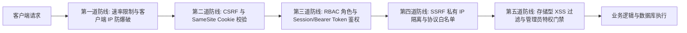

# 🛡️ 安全机制与运维规范 (Security & Operations)

安全是 Navelix 设计的核心基石。本篇文档系统介绍 Navelix 的安全设计原则、防御机制与最佳运维实践。

---

## 🔐 核心安全防御体系



---

## 1. 🛡️ 登录限流与防暴力破解 (Rate Limiting)
- **多维度锁定机制**：
  - 基于 Client ID（真实客户端 IP 或用户名）对登录接口进行失败频次统计；
  - 连续失败超过 5 次即自动触发渐进式阶梯冷却锁（锁定 15 分钟），并返回友好倒计时提示；
- **反向代理 IP 感知**：
  - 严格支持 `TRUST_PROXY=true` 环境变量，仅在声明信任代理时才解析 `X-Forwarded-For`，杜绝伪造 HTTP 标头绕过限流的攻击面。

---

## 2. 🛡️ 跨站请求伪造 (CSRF Protection)
- **Origin 与 Host 一致性校验**：
  - 对所有状态变更请求（POST / PUT / PATCH / DELETE）进行严格的 Origin 与 Host 标头一致性检查；
- **开放 API 免扰机制**：
  - 携带合法 Bearer Token (`nvx_live_...`) 的请求自动豁免 Origin 校验，完美兼容脚本、快捷指令与自动化流水线。

---

## 3. 🛡️ 服务器端请求伪造 (SSRF Protection)
- **`safeFetch` 安全隔离引擎**：
  - 在拉取外部网址 Favicon、网页元数据、天气数据及 AI 端点时，自动进行 DNS 解析并拦截私有网络 IP（`10.0.0.0/8`, `172.16.0.0/12`, `192.168.0.0/16`, `127.0.0.1`, `169.254.169.254` 等）；
  - 严禁 `file://`, `gopher://`, `ftp://` 等危险协议，杜绝探测内网服务或云元数据接口。

---

## 4. 🛡️ 个人 API Token 安全 (SHA-256 Storage)
- **单向哈希存储**：
  - 个人 API Access Token (`nvx_live_...`) 仅在生成时在前端展示一次，服务端数据库**仅保存 SHA-256 哈希值**；
  - 即使数据库文件意外泄露，攻击者也无法逆向还原出可用明文 Token。

---

## 5. 🛡️ 存储型 XSS 防御与代码注入门禁
- **管理员特权收口**：
  - 允许注入自定义 CSS / 统计脚本的配置项，在服务端严格绑定 `admin` 管理员角色权限校验；
  - 普通用户与访客无权修改页面结构，杜绝存储型 XSS 与数据窃取风险。

---

## 📦 备份与运维最佳实践 (Operations Best Practices)

### 1. SQLite 物理快照在线热备 (`VACUUM INTO`)
- 系统内置 SQLite 原生 `VACUUM INTO` 机制，在数据库处于高并发读写状态下仍能**无锁生成 100% 完整一致的二进制数据库快照**；
- 建议管理员每周在后台 **「设置 → 数据库备份」** 下载一份备份文件归档。

### 2. 宿主机数据目录定时备份脚本示例
在宿主机 Linux crontab 中添加定时归档任务：
```bash
# 每天凌晨 3:00 自动打包备份 Navelix 数据目录
0 3 * * * tar -czf /backup/navelix-data-$(date +\%Y\%m\%d).tar.gz /opt/navelix/data
```

---

*下一步：请参阅 [[REST API 开放接口规范|REST-API-开放接口文档]] 了解接口接入详情。*
