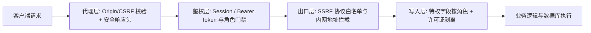

# 🛡️ 安全机制与运维规范 (Security & Operations)

安全是 Navelix 设计的核心基石。本篇文档系统介绍 Navelix 的安全设计原则、防御机制与最佳运维实践。

---

## 🔐 核心安全防御体系


```mermaid
graph LR
    Req["客户端请求"] --> L1["代理层: Origin/CSRF 校验 + 安全响应头"]
    L1 --> L2["鉴权层: Session / Bearer Token 与角色门禁"]
    L2 --> L3["出口层: SSRF 协议白名单与内网地址拦截"]
    L3 --> L4["写入层: 特权字段按角色 + 许可证剥离"]
    L4 --> Server["业务逻辑与数据库执行"]
```

> 说明：**速率限制不在这条链路上** —— 它只作用于登录与会话撤销两个接口，详见 §1。

---

## 1. 🛡️ 登录限流与防暴力破解 (Rate Limiting)

> 限流**只作用于两个接口**：`POST /api/auth/login` 与 `DELETE /api/auth/sessions`（后者 30 次/分钟）。其余接口——包括注册、AI 调用、数据写入——目前**没有**限流。

- **单一固定窗口**：按 `Client ID + 用户名` 统计失败次数，**第 5 次失败即锁定 15 分钟**（锁定窗口从首次失败起算，不是逐级升级的阶梯冷却），并返回友好倒计时提示；
- **反向代理 IP 感知**：
  - 开启 `TRUST_PROXY=true` 时会解析 `X-Forwarded-For`；
  - ⚠️ **但请注意**：**即使未开启 `TRUST_PROXY`，系统仍会采信客户端自带的 `X-Real-IP`**。若实例直接暴露公网且前置没有可信代理，攻击者每次请求换一个 `X-Real-IP` 就能获得全新的限流桶，从而绕过锁定。**公网部署请置于反向代理之后，并在代理层剥离或覆写客户端传来的 `X-Real-IP` / `X-Forwarded-For`。**
- **状态存储**：限流计数保存在**进程内存**中——重启即清零，多副本部署时各自独立计数。

---

## 2. 🛡️ 跨站请求伪造 (CSRF Protection)
- **Origin 与 Host 一致性校验**：
  - 对所有 `/api/**` 的状态变更请求（POST / PUT / PATCH / DELETE）进行 Origin / Referer 校验，既无可校验来源又无 Bearer 头时直接返回 **403**；
- **开放 API 免扰机制**：
  - 请求头中**存在** `Authorization: Bearer …` 即自动豁免 Origin 校验，兼容脚本、快捷指令与自动化流水线；
  - ⚠️ 该豁免只判断头部**是否存在**及 `bearer ` 前缀，**不校验 Token 是否有效、是否在库**——真正的鉴权发生在后续路由里。

---

## 3. 🛡️ 服务器端请求伪造 (SSRF Protection)
- **`safeFetch` 安全隔离引擎**：
  - 默认对目标做 DNS 解析并拦截内网地址（`10.0.0.0/8`、`172.16.0.0/12`、`192.168.0.0/16` 等私有网段，以及 `127.0.0.0/8`、`169.254.169.254` 云元数据地址）；
  - 严禁 `file://`、`gopher://`、`ftp://` 等危险协议。
- **⚠️ 以下调用点显式放行私有网段**（仅拦截回环与链路本地地址），这是**有意设计**而非疏漏：
  - **Favicon 抓取**（`/api/favicon`）：为了让自建 NAS / 路由器 / 内网服务的图标能正常显示，主动允许访问内网地址；
  - **AI 端点**（`/api/ai/chat`、`/api/ai/daily-schedule`、`/api/ai/project-breakdown`、`/api/ai/summarize`）：允许把 BaseURL 指向内网或本机服务（例如自建的 Ollama）。
  - **含义**：能配置这些项的用户，可以借服务端发起对内网的请求。请勿把管理员权限授予不可信的人；对公网暴露实例时尤其注意。
- 天气、Telegram、健康巡检等其余出网点使用默认的**严格模式**。

---

## 4. 🛡️ 个人 API Token 安全 (SHA-256 Storage)
- **单向哈希存储**：
  - 个人 API Access Token (`nvx_live_...`) 仅在生成时在前端展示一次，服务端数据库**仅保存 SHA-256 哈希值**；
  - 即使数据库文件意外泄露，攻击者也无法逆向还原出可用明文 Token。

---

## 5. 🛡️ 代码注入字段的门禁

- **注入门禁 = 管理员角色 + 许可证特性**：
  - 可注入自定义 CSS / 统计脚本的字段（`customHeadScripts` / `customCss` / `logoImage` / `siteTitle` / `logoText`），在 `POST /api/user/data` 写入时要求 `admin` 角色**且**具备对应许可证特性，否则字段会被直接剥离；
  - `GET /api/user/data` 的回读脱敏同样以**许可证特性**为门槛（不只是角色判断），未授权时返回空串与默认值。
- **⚠️ 系统不对这些字段做 HTML 净化**：它们本就是为了让站长注入原始 CSS/`<script>` 而设计的，代码中**不存在** sanitize / 转义 / 白名单机制，写入时仅打印一条 `console.warn`。其安全性完全依赖上一条的门禁。
- **⚠️ SSR 路径不经过 API 脱敏**：页面服务端渲染走内部数据函数，而非 `GET /api/user/data`，该路径没有同等强度的脱敏判断。因此**若你开启了「未登录访客公开访问」**，已启用的标题 / Logo / 注入脚本会随页面一起下发给访客并执行。开启公开访问前，请确认这些内容都是可以公开的。

## 6. 🛡️ 默认保守安全策略（新部署即安全）
- **访问模式默认私有**：新部署默认关闭「未登录访客公开访问」与「开放新用户注册」，防止首次启动后直接暴露公网；
- **首次登录安全引导**：首次登录后，管理员会在首页看到安全设置引导横幅，指引完成两件事：
  1. 前往「个人账号与安全」修改初始登录密码；
  2. 前往「系统与数据管理 → 访问与安全策略控制」按需开启公开访问或开放注册；
- 开启任一访问策略开关或完成改密后，引导横幅自动消失；也可点「我已了解」手动关闭；
- 存量实例升级不受影响：已配置的访问/注册策略保持不变，也不会弹引导横幅。
- 忘记密码时：
  - **普通账号**：由管理员在后台「账号管理」重置；
  - **管理员账号**：系统**没有**自助重置入口或找回流程。环境变量 `NAVELIX_ADMIN_PASSWORD` 只在两种情况生效——**首次初始化**（库中还没有用户）、或**当前密码仍是历史弱密码 `admin123`**（由一次性迁移轮换）。对已设置过自定义密码的实例，设置该变量并重启**不会**改密。
    此时可行的路径只有：用一份你知道密码时期的 `.db` 备份还原，或直接用 SQLite 工具改写 `users` 表中的 `password_hash`（scrypt 格式，见 `src/lib/password.ts`）。详见 [[FAQ Q1|FAQ-常见问题与故障排查]]。

---

## 📦 备份与运维最佳实践 (Operations Best Practices)

### 1. SQLite 物理快照在线热备 (`VACUUM INTO`)
- 系统内置 SQLite 原生 `VACUUM INTO` 机制，**无需停机**即可生成完整一致的二进制数据库快照（过程中仍会短暂持有读事务，但不阻塞写入）；
- 下载路径：后台 → **系统与数据管理 → 数据库物理快照与备份还原**；同一页面上传 `.db` 文件即可整体还原（需管理员输入当前密码二次确认）；
- `data/backups/*.db` 最多保留**最近 7 份**，超出部分自动清理；
- ⚠️ **免费版本没有定时自动备份**：只有后台手动备份、破坏性迁移前的自动快照、以及 Pro 版的每日云端备份会生成快照。请自行安排定时归档（见下一节）。

### 2. 宿主机数据目录定时备份脚本示例
在宿主机 Linux crontab 中添加定时归档任务：
```bash
# 每天凌晨 3:00 自动打包备份 Navelix 数据目录
0 3 * * * tar -czf /backup/navelix-data-$(date +\%Y\%m\%d).tar.gz /opt/navelix/data
```

---

## 7. 🧩 其他安全机制速查

| 机制 | 说明 |
| :--- | :--- |
| **HTTP 安全响应头 / CSP** | 由 `next.config.ts` 与代理层统一下发；`connect-src 'self'`，`script-src` 含 `'unsafe-inline'`（自定义注入特性所需）。**HSTS 仅在 `NAVELIX_COOKIE_SECURE=true` 时下发** |
| **会话生命周期** | HttpOnly Cookie 会话：空闲 **7 天**失效，硬上限 **30 天** |
| **安全审计日志** | `audit_logs` 表记录备份 / 还原 / AI Key 变更等敏感操作 |
| **只读分享令牌** | `/api/share/token` 生成的分享链接采用 HKDF 派生 + HMAC-SHA256 签名，带有效期，只读 |
| **Telegram 安全告警** | 登录连续失败、磁盘占用、WAL 膨胀、服务启动等事件可推送 |
| **Pro 模块（EE）** | 商业能力以 bytenode 字节码加载，许可证使用 Ed25519 验签；公开源码不含 EE 实现 |
| **匿名遥测** | 本地埋点与每周匿名聚合上报**均默认开启**（埋点仅写本机 SQLite，周报为匿名聚合计数）。可用 `NAVELIX_ANALYTICS=off` / `NAVELIX_ANALYTICS_REPORT=off`，或在后台对应页面关闭 |
| **密码哈希** | 使用 **scrypt**（`node:crypto`）+ 定时安全比较；SHA-256 仅用于会话 / Token 摘要与分享令牌派生 |

---

*下一步：请参阅 [[REST API 开放接口规范|REST-API-开放接口文档]] 了解接口接入详情。*
